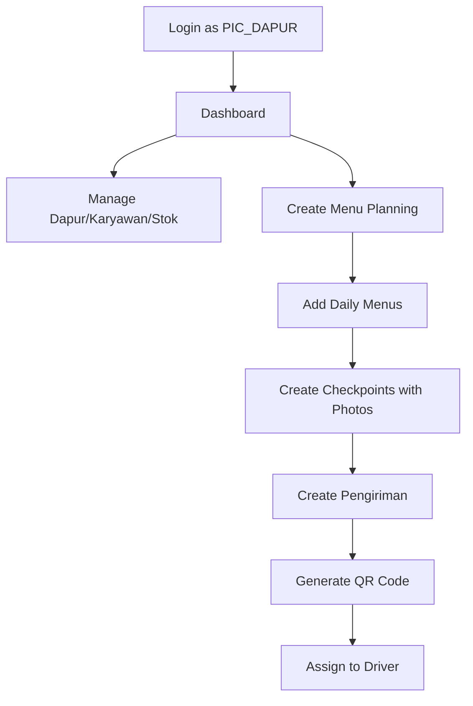
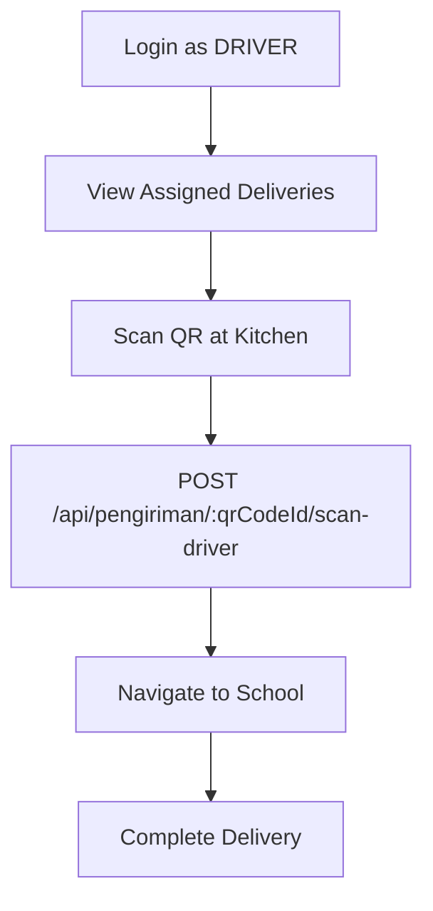
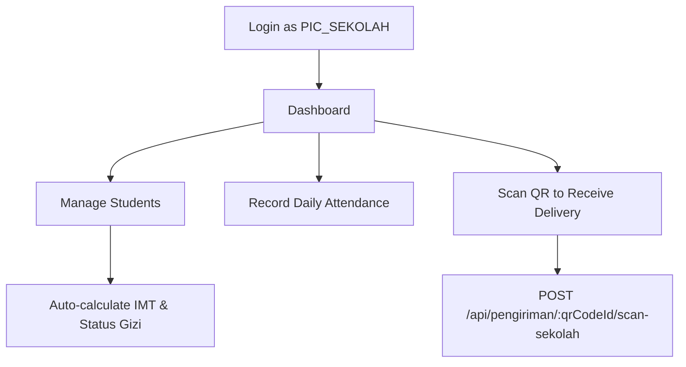

# MBG Mobile App - Role-Based Navigation Implementation

## Overview

This app implements **role-based drawer navigation** for three different user roles:

- **PIC_DAPUR** (Kitchen Manager)
- **DRIVER** (Delivery Driver)
- **PIC_SEKOLAH** (School Manager)

The bottom navigation (`navigation_menu.dart`) is for **development/testing purposes only** to allow quick switching between roles during development.

---

## Architecture

### User Roles & Authentication

Each user has a specific role defined in the `UserModel`:

```dart
class UserModel {
  final String role; // 'PIC_DAPUR', 'DRIVER', or 'PIC_SEKOLAH'
  // ... other fields
}
```

### Role-Based Drawer System

Each role has a dedicated drawer widget with specific menu items:

#### 1. **PIC_DAPUR** Drawer (`drawer_pic_dapur.dart`)

Navigation Items:

- Dashboard - Daily timeline and progress
- Dapur - Kitchen management
- Karyawan - Employee management (with photos)
- Stok - Inventory management
- Menu Planning - Weekly menu creation
- Checkpoint - Photo checkpoints (MULAI_MEMASAK, SELESAI_MEMASAK)
- Pengiriman - Delivery management & QR generation
- Setting

#### 2. **DRIVER** Drawer (`drawer_driver.dart`)

Navigation Items:

- Dashboard - Driver overview
- My Deliveries - Assigned deliveries list
- QR Scanner - Scan QR for pickup confirmation
- History - Past deliveries
- Setting

#### 3. **PIC_SEKOLAH** Drawer (`drawer_pic_sekolah.dart`)

Navigation Items:

- Dashboard - School overview
- Sekolah - School information
- Kelas - Class management
- Siswa - Student management (IMT & Status Gizi auto-calculated)
- Absensi - Daily attendance recording
- Nutrisi - Nutrition monitoring
- Receive Delivery - QR scanner for receiving food
- Menu - View weekly menu planning
- Setting

---

## Implementation Details

### 1. Screen Structure

Each role has its own main screen with `IndexedStack` to switch between drawer menu items:

**PIC_DAPUR:**

```
lib/features/dapur/screens/
  ├── dapur.dart (Main screen with IndexedStack)
  ├── dapur_management_screen.dart
  ├── karyawan_management_screen.dart
  ├── stok_management_screen.dart
  ├── menu_planning_screen.dart
  ├── checkpoint_screen.dart
  └── pengiriman_screen.dart
```

**DRIVER:**

```
lib/features/driver/screens/
  ├── driver.dart (Main screen with IndexedStack)
  ├── driver_dashboard_screen.dart
  ├── my_deliveries_screen.dart
  ├── qr_scanner_screen.dart
  └── delivery_history_screen.dart
```

**PIC_SEKOLAH:**

```
lib/features/sekolah/screens/
  ├── sekolah.dart (Main screen with IndexedStack)
  ├── sekolah_dashboard_screen.dart
  ├── sekolah_management_screen.dart
  ├── kelas_management_screen.dart
  ├── siswa_management_screen.dart
  ├── absensi_screen.dart
  ├── nutrition_monitor_screen.dart
  ├── receive_delivery_screen.dart
  └── menu_view_screen.dart
```

### 2. Controllers

Each role has a dedicated controller:

**DapurController** (`lib/features/dapur/controllers/dapur_controller.dart`)

```dart
class DapurController extends GetxController {
  final RxInt drawerSelectedIndex = 0.obs; // Current drawer menu index
  // ... other observables
}
```

**DriverController** (`lib/features/driver/controllers/driver_controller.dart`)

```dart
class DriverController extends GetxController {
  final RxInt drawerSelectedIndex = 0.obs;
  final RxList<dynamic> deliveries = <dynamic>[].obs;
  // ... methods for API calls
}
```

**SekolahController** (`lib/features/sekolah/controllers/sekolah_controller.dart`)

```dart
class SekolahController extends GetxController {
  final RxInt drawerSelectedIndex = 0.obs;
  final RxList<dynamic> students = <dynamic>[].obs;
  final RxList<dynamic> classes = <dynamic>[].obs;
  // ... methods for API calls
}
```

---

## API Integration Flow

### Authentication Flow

```
1. User logs in → POST /api/auth/login
2. Receive JWT token + user data (including role)
3. Store token in local storage
4. Navigate to role-specific screen
```

### PIC_DAPUR Flow



**Key API Endpoints:**

- `POST /api/dapur` - Create kitchen
- `POST /api/karyawan` - Add employee (with image upload)
- `POST /api/stok` - Add inventory
- `POST /api/menu-planning` - Create weekly menu
- `POST /api/menu-harian/:menuHarianId/checkpoint` - Add checkpoint with photo
- `POST /api/pengiriman` - Create delivery with QR code

### DRIVER Flow



**Key API Endpoints:**

- `GET /api/driver/pengiriman` - Get assigned deliveries
- `POST /api/pengiriman/:qrCodeId/scan-driver` - Confirm pickup

### PIC_SEKOLAH Flow



**Key API Endpoints:**

- `POST /api/sekolah/:sekolahId/siswa` - Add student (with image, auto IMT calculation)
- `POST /api/siswa/:siswaId/alergi` - Add student allergy
- `POST /api/kelas/:kelasId/absensi` - Record attendance
- `GET /api/sekolah/:sekolahId/absensi/total/:tanggal` - Get total attendance
- `POST /api/pengiriman/:qrCodeId/scan-sekolah` - Receive delivery

---

## Features to Implement

### Immediate Priority

1. **API Service Layer**

   - Create service classes for each feature
   - Implement HTTP calls using `MBGHttpHelper`
   - Error handling and loading states

2. **Image Upload**

   - Karyawan photos (PIC_DAPUR)
   - Siswa photos (PIC_SEKOLAH)
   - Checkpoint photos (PIC_DAPUR)
   - Use `image_picker` package (already added)

3. **QR Code Functionality**
   - QR Code generation for deliveries (PIC_DAPUR)
   - QR Scanner for pickup (DRIVER)
   - QR Scanner for receiving (PIC_SEKOLAH)
   - Install: `qr_code_scanner` and `qr_flutter`

### Secondary Features

4. **Forms & Validation**

   - Create Dapur form
   - Add Karyawan form (with image picker)
   - Add Siswa form (auto IMT calculation)
   - Menu planning forms
   - Attendance recording

5. **Data Display**

   - List views for all entities
   - Detail screens
   - Filter and search functionality

6. **Charts & Analytics**
   - Nutrition status charts (PIC_SEKOLAH)
   - Delivery statistics (DRIVER)
   - Progress tracking (PIC_DAPUR)
   - Use `fl_chart` package

---

## Auto-Calculated Fields

### Student IMT & Status Gizi (PIC_SEKOLAH)

When creating a student, the API automatically calculates:

- **IMT** (Indeks Massa Tubuh) = beratBadan / (tinggiBadan/100)²
- **Status Gizi** based on IMT value

The mobile app should display these calculated values but doesn't need to compute them.

---

## Development vs Production

### Development Mode (Current)

- `navigation_menu.dart` with bottom navigation showing all 3 roles
- Quick switching for testing

### Production Mode (Future)

1. Remove bottom navigation
2. Route directly to role-specific screen after login:

```dart
switch (userRole) {
  case 'PIC_DAPUR':
    Get.offAll(() => DapurScreen());
  case 'DRIVER':
    Get.offAll(() => DriverScreen());
  case 'PIC_SEKOLAH':
    Get.offAll(() => SekolahScreen());
}
```

---

## Next Steps

1. **Install Required Packages**

```bash
flutter pub add qr_code_scanner qr_flutter fl_chart intl
```

2. **Create API Service Classes**

```
lib/utils/http/
  ├── dapur_service.dart
  ├── driver_service.dart
  └── sekolah_service.dart
```

3. **Implement Real Data Fetching**

   - Replace placeholder screens with actual API calls
   - Add loading states and error handling

4. **Build Forms**

   - Image picker integration
   - Form validation
   - Submit to API

5. **Add QR Functionality**

   - QR generation for deliveries
   - Scanner screens for DRIVER and PIC_SEKOLAH

6. **Polish UI/UX**
   - Add proper loading indicators
   - Error messages
   - Success feedback
   - Empty states

---

## File Reference

### Common Widgets

- `lib/common/widgets/drawer_pic_dapur.dart` - PIC_DAPUR drawer
- `lib/common/widgets/drawer_driver.dart` - DRIVER drawer
- `lib/common/widgets/drawer_pic_sekolah.dart` - PIC_SEKOLAH drawer
- `lib/common/widgets/drawer_header.dart` - Shared header
- `lib/common/widgets/drawer_footer.dart` - Shared footer

### Controllers

- `lib/features/dapur/controllers/dapur_controller.dart`
- `lib/features/driver/controllers/driver_controller.dart`
- `lib/features/sekolah/controllers/sekolah_controller.dart`
- `lib/features/authentication/controllers/user_controller.dart`

### Main Screens

- `lib/features/dapur/screens/dapur.dart`
- `lib/features/driver/screens/driver.dart`
- `lib/features/sekolah/screens/sekolah.dart`

---

## API Base URL

Configure in `.env`:

```
API_BASE_URL=http://localhost:3000/api
```

Or update in production:

```
API_BASE_URL=https://your-production-api.com/api
```

---

## Questions or Issues?

Refer to the Postman collection for detailed API documentation:

- Authentication endpoints
- Request/response formats
- Required fields
- Role permissions
